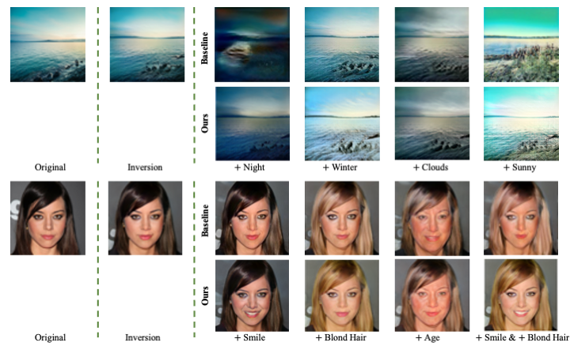
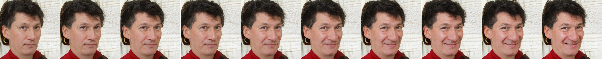
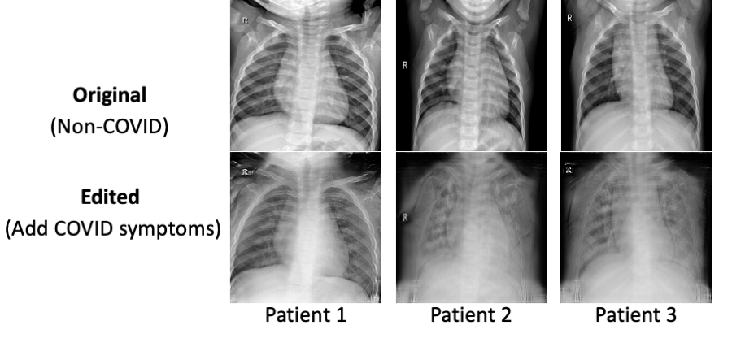

# Enjoy Your Editing: Controllable GANs for Image Editing via Latent Space Navigation



This is the official code base for our ICLR 2021 paper: Peiye Zhuang, Oluwasanmi Koyejo, Alexander G Schwing, [Enjoy Your Editing: Controllable GANs for Image Editing via Latent Space Navigation](https://arxiv.org/abs/2102.01187). 

In this repository, we propose a latent-space editing framework for semantic image manipulation that fulfills (i) providing continuous manipulation of multiple attributes simultaneously, and (ii) maintaining the original image’s identity as much as possible while ensuring photo-realism.

## Requirements

This code has been tested with Python 3.7, PyTorch 1.6, CUDA11.0, and GCC>=4.9 on CentOS 7.8.2003. Install basic Machine Learning packages such as importlib, logging, PIL, etc.

## Get Started 

An example of face image editing using StyleGANv2:

1. Download the [StyleGAN2 weights](https://drive.google.com/file/d/1PQutd-JboOCOZqmd95XWxWrO8gGEvRcO/view) pretrained on FFHQ dataset and put the file to */path/to/gan*.

2. Download the [ResNet-50 classifier weights](https://drive.google.com/file/d/17Xwr6UBpdkXY70EMpEGJAEX_8QfFvL8-/view?usp=sharing) pretrained on CelebA dataset and put the file to */path/to/classifier*.

3. Modify L16 and L18 in *Latent2im/graphs/stylegan_v2_real/constants.py* using the above paths.


4. Training command exmaple
   
   ```
   python train.py --model stylegan_v2_real --transform face \
        --num_samples 20000 --learning_rate 1e-4 --latent w \
        --walk_type linear --loss l2 --gpu 0 --attrList Smiling \
        --attrPath './dataset/attributes_celeba.txt' \
        --models_dir ./models_celeba (add --overwrite_config to renew the saving folder)
   ```
    
5.  Inference command exmaple
    ```
    python vis_w.py models_celeba/stylegan_v2_real_face_linear_lr0.0001_l2_w/opt.yml \
        --gpu 0 --noise_seed 0 --num_samples 30 --num_panels 10 \
        --save_path_w  /path/to/model_w_10_final_walk_module.ckpt  
    ```
6. You may also use our pretrained [meaningful latent directions](https://drive.google.com/drive/folders/1VpAK392i9wlP9e0u8rHfwlq1nNoj57Ku?usp=sharing). Using the above inference command, you will get editing results of one subject with linearly spaced attribute steps. Example results are shown below:
  

7. More pretrained models can be found [here](https://drive.google.com/drive/folders/1VpAK392i9wlP9e0u8rHfwlq1nNoj57Ku?usp=sharing).
## Applications

We also verify the effacacy of our work on medical imaging such as chest X-ray images. For instance, using our model, we find latent directions for COVID-19 synpotoms on X-ray images.



## Citation

If you find our work or repo useful in your research, please consider citing our paper:

```
@inproceedings{ZhuangICLR2021,
  author = {P. Zhuang and O. Koyejo and A.~G. Schwing},
  title = {{Enjoy Your Editing: Controllable GANs for Image Editing via Latent Space Navigation}},
  booktitle = {Proc. ICLR},
  year = {2021},
}
```
